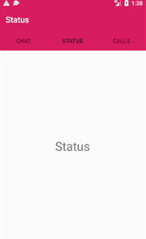

# CLASS 4
- Fragments
- Async Task

#

# Resources
### Fragments
- [Creating Fragments](	https://developer.android.com/training/basics/fragments/creating)
- [Fragments Example](FragmentsExample)
- [View Pager tutorial](https://www.codingdemos.com/android-tablayout-example-viewpager/)
- [View Pager Example](ViewPagerExample)
### Async Task
- [Async Task tutorial](https://www.journaldev.com/9708/android-asynctask-example-tutorial)
- [Async Task Example](AsyncExample)