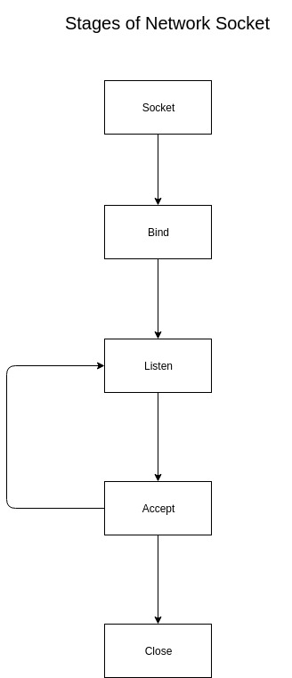

# Java Class - 5

## Socket Programming

### Resources

- [Reading From and Writing to Sockets](https://docs.oracle.com/javase/tutorial/networking/sockets/readingWriting.html)
- [Writing a Client/Server pair](https://docs.oracle.com/javase/tutorial/networking/sockets/clientServer.html)
- [Socket Programming: GeeksForGeeks](https://www.geeksforgeeks.org/socket-programming-in-java/)


<div align="center"></div>

The following is the code for a basic server.
```java
import java.net.*;
import java.io.*;


public class Server{
    private final static int port = 8888;

    public static void main(String args[]){
        ServerSocket ssock = null;
        try{

            ssock = new ServerSocket(port);

        }catch(Exception e){
            e.printStackTrace();
            System.out.println("Error occured...failed to initialize Server Socket");
        }

        while(true){
            Socket sock = null;
            try{
            	System.out.println("Waiting for connection..!!");
                sock = ssock.accept();
                System.out.println("Connection received...!!!");
               new Thread(new ClientHandler(sock)).start();

            }catch(Exception e){
                e.printStackTrace();
                System.out.println("Failed to connect to client..!!");
            }
        }
    }
}
```

The following is the code for Client which can connect to the server.
``` java
import java.io.*;
import java.net.*;
import java.util.Scanner;


public class Client{
    
    public static void main(String[] args){
        Scanner sc = new Scanner(System.in);
        System.out.print("Enter server IP: ");
        String serverIP = sc.next();
        System.out.print("Enter port: ");
        int port = sc.nextInt();

        Socket sock=null;

        try{
            sock = new Socket(serverIP, port);
            System.out.println(""+sock.getInetAddress());
            System.out.println(""+sock.getPort());

            System.out.println("Connected to the server");

            DataOutputStream dos = new DataOutputStream(sock.getOutputStream());
            DataInputStream dis = new DataInputStream(sock.getInputStream());

            new Thread(new ClientHandler(sock)).start();
            
            while(true){
                String msg = sc.next();
                dos.writeUTF(msg);
            }

        }catch(Exception e){
            e.printStackTrace();
            System.out.println("Cannot connect to server...!!");
        }
    }

}
```

The following code is the code for ClientHandler
``` java
import java.io.*;
import java.net.*;


public class ClientHandler implements Runnable{
    private Socket sock;
    DataInputStream dis;

    ClientHandler(Socket sock){
        this.sock = sock;
    }

    public void run(){

        try{
            dis = new DataInputStream(sock.getInputStream());

            while(true){
                System.out.println("Received message: "+ dis.readUTF());
            }

        }catch(Exception e){
            e.printStackTrace();
            System.out.println("Some error occured");
        }
    }

}
```

### Code

- [Simple Client-Server Communication](https://github.com/Abhishek1103/2019-20-Classes/tree/master/Java/2019_09_03_Java-Class-5/Codes/SimpleClient-ServerComm)
- [Client-Server Pair communicating objects](https://github.com/Abhishek1103/2019-20-Classes/tree/master/Java/2019_09_03_Java-Class-5/Codes/ChatSystem)

For any queries, feel free to contact us.
- Abhishek Kumar Singh
- Surbhit Awasthi
- Shreyas Dobhal
- Ashish Gopal
- Sri Ram Khandelwal
- Tushar Srivastava
- Paras Saini
- Himanshu Purwar
- Shreshtha Dwivedi
- Araish Aftab